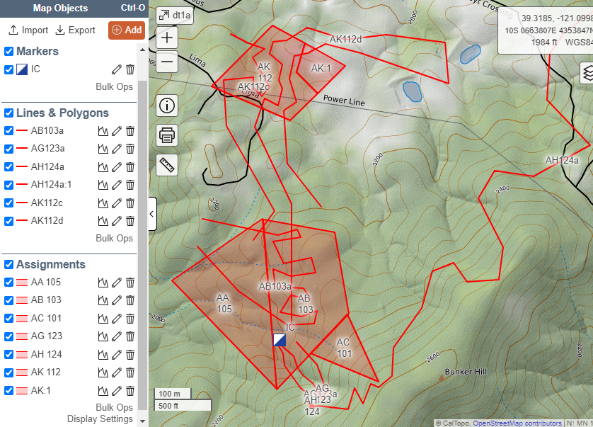
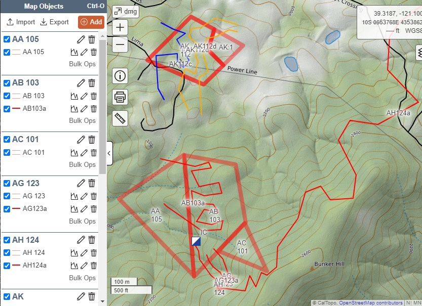
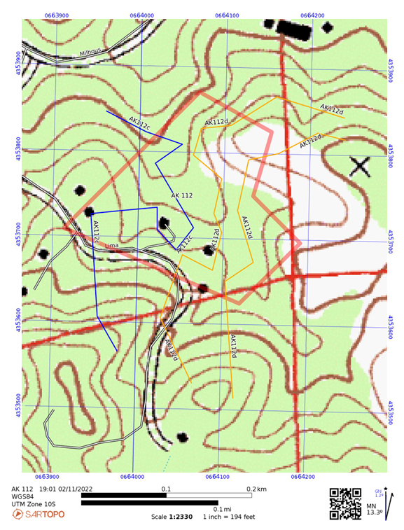
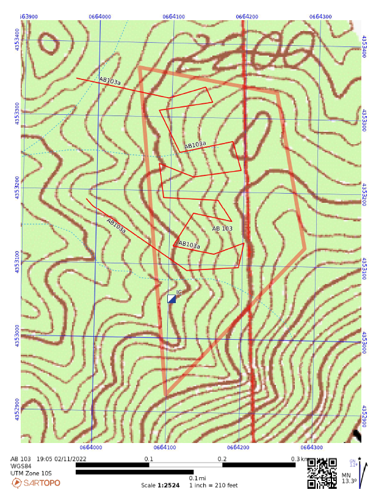
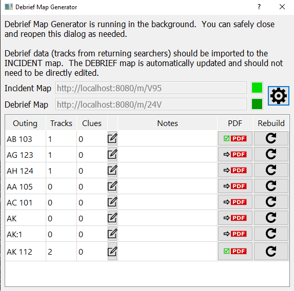

# sartopo_bg
sartopo background automation using sartopo_python

There are a lot of possible background sartopo tasks.  For now, this repo exclusively deals with Derief Map Generation.  The repo name may be changed accordingly.

# Debrief Map Generator (DMG)

This tool generates high quality individual team debrief maps, with minimal need for user intervention.

In our experience, only these features should be included on the print map:

1. assignment boundary
2. relevant portions of tracks of the current team's members (including unfinished AppTracks)
    - for roaming teams, such as trailing dogs or trackers, crop the tracks to some reasoably large distance (10km or so) from their starting assignment shape
    - for all other teams, crop the tracks to a bit beyond their assignment boundary
3. clues located by the team
4. clues located by other teams
5. other relevant map markers and lines that are not specific to the assignment (IC / CP, gates, trails, etc.)

The print map should be zoomed and positioned such that the page is mostly filled up by features from the first three of these categories, with a reasonable buffer.

Features in the last two categories should be drawn only if they are inside the print area determined by the first three categories.

To minimize clutter and maximize the effectveness of the team debrief, the map should typically NOT include any of these:
1. irrelevant portions of team member tracks - straight lines from IC, straight lines from home, etc.
2. tracks from other searchers - only the team members from this assignment should be shown
3. boundaries from other assignments

Different SAR teams may find that different styles of debrief maps work better for their purposes.  Please send your feedback and ideas!

Generating good quality team debrief maps has always been elusive and labor intensive, to the point where it often just doesn't happen, or, a cluttered or incomplete 'compromise map' is used for team debrief instead.  This compromises the quality of the team debrief process, while creating a lot of delay, and a lot of heartburn in the command post.  Hopefully, this tool can alleviate or even eliminate those problems.

Debrief Map Generator (DMG) runs in the background for the duration of the incident, updating a separate SARTopo or CalTopo Desktop map (the 'Debrief Map') as your team works on the main incident map.  Normally, there is no need to view the Debrief Map, and the only necessary user intervention is to click the 'Generate PDF' button in DMG after all the tracks and clues for an assignment have been imported.

Sample incident map:

Corresponding debrief map.  You might never need to view this map, but, since it is organized with each 'outing' in its own folder, you can use this map to more easily build custom debrief maps of multiple outings:

Generated debrief PDF:

Generated debrief PDF:

Debrief Map Generator user interface:

### What's an 'outing'?
DMG uses the term 'outing' to refer to the pairing of a given assignment shape with a given team.  There are a few important distinctions between the terms 'Assignment' and 'Outing':
- Assignment
  - might not have any team assigned to it
  - might be renamed on the incident map when reassigned to a different team
- Outing
  - must remain as a part of the record even if the assignment is reassigned to a different team

An Outing is created when a team is assigned to an Assignment.

For example: Team 101 may be assigned to AA.  After 101 returns, team 105 may then be assigned to AA.  Regardless of whether a new assignment 'AA 105' is created on the incident map, or if the existing assignment 'AA 101' is renamed to 'AA 105', the two outings 'AA 101' and 'AA 105' are both part of the record and may both have their own sets of tracks.  Searcher tracks for 'AA 101' may not get imported until after 'AA 105' has started.  The 'outings' concept accounts for these possibilities.

## Other ways to build debrief maps

### Using the 'ownership' concept
For now, SARTopo still supports the concept of ownership.  This concept will most likely be eliminated at some point in the future.  (DMG does not rely on the ownership concept.)

- Operational Periods own Assignments
- Assignments own Tracks, Clues, and Waypoints
  - A Track is a Line that is owned by an Assignment
  - a Clue is a Marker that is owned by an Assignment
  - a Waypoint is a Marker that is owned by an Assignment but which has no clue-specific data

Printing an 'Assignment Map' from Assignment Bulk Ops will generate a PDF that includes the assignment boundary and everything owned by it.  

So, if data imported from searcher GPSes is converted to 'Tracks' and 'Clues' as appropriate, or is imported 'to the assignment' such that they are Tracks and Clues from the start, then printing an Assignment Map can get close to the goal - but there are significant hurdles and drawbacks:
- making sure that all imported lines and markers are Tracks and Clues owned by the proper assigment can be very labor-intensive and error-prone
- 'cleaning up' the Tracks, by cutting and deleting, is labor-intensive and error-prone; but, since the bulk-ops-generated Assignment Map extents are determined by the largest extents of owned features, skipping the cleanup step means that the benefits of Assignment Map automatic zooming and positioning are lost.  If a searcher's tracks include a straight line from home, that will be part of the generated Assignment Map - which will automatically be zoomed out to include the entire track -  unless cleanup is done first.
- the assignment boundary will be drawn with a fixed amount of opacity, obscuring the map baselayer beneath it, and generally making annotations during debrief less clear
- features that are not owned by the assignment, such as IC / CP, gates, trails, etc, are not shown on the generated Assignment Map

### Bypassing the 'ownership' concept
A common alternative to printing Assignment Maps from Bulk Ops is to just print an area of the incident map, maybe spending a few seconds first to uncheck some categories of features that should not be shown on the printed map.  This can be much quicker overall, since there is no need to pay attention to 'ownership' as above.  In some cases, this gets fairly close to the goal, but time and attention to detail is still needed in map preparation.

